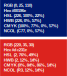

# Logos and Icons

AILERON Projects logo sets.
SVG images under this directory are in [Inkscape svg](https://inkscape.org/) formats.

## Trademarks

AILERON Projects Trademarks are registered in Japan.

- [JP-2023-094167](https://www.j-platpat.inpit.go.jp/c1801/TR/JP-2023-094167/40/en)
- [JP-2023-094168](https://www.j-platpat.inpit.go.jp/c1801/TR/JP-2023-094168/40/en)

## Brand colors

AILERON Projects uses 2 basic brand colors.

## Icons

**Light theme icon**.

**Dark theme icon**.

## Logos

**Light theme logos**.

 

**Dark theme logos**.

 

