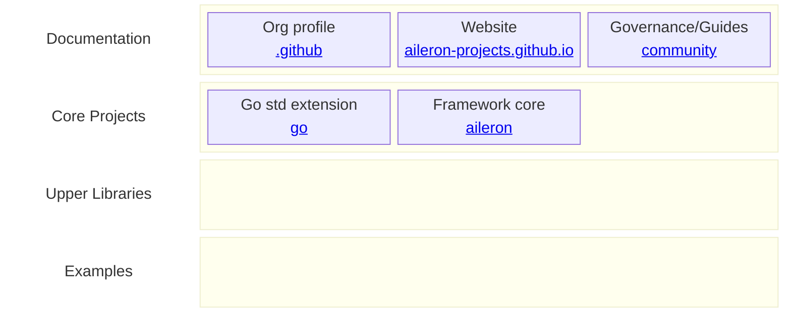

# :tada: Welcome to the AILERON Projects Community :tada:

> [!NOTE]
> **AILERON Projects — Go web framework for cloud-native enterprise systems.**

AILERON Projects leverages [Go](https://go.dev/).

## Documentations

- [Website](https://aileron-projects.github.io/)

## Repositories

| Repository | Content |
| - | - |
| [aileron-projects.github.io](https://github.com/aileron-projects/aileron-projects.github.io) | Website resources. |
| [community](https://github.com/aileron-projects/community) | Governance and guidelines. |
| [.github](https://github.com/aileron-projects/.github) | Organization profiles. |
| [go](https://github.com/aileron-projects/go) | Go standard package extensions. |
| [aileron](https://github.com/aileron-projects/aileron) | Core library of the framework. |

**Repository overview.**

