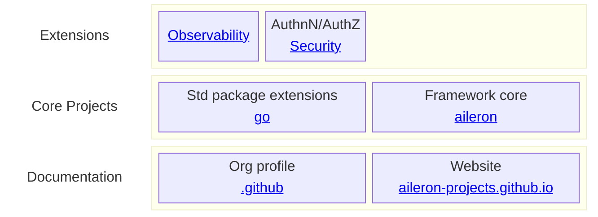

# :tada: Welcome to the AILERON Projects Community :tada:

> [!NOTE]
> **AILERON Projects — Go framework for cloud-native enterprise systems.**

AILERON Projects leverages [Go](https://go.dev/).

## Documentations

- [Website](https://aileron-projects.github.io/)

## Repositories

```mermaid
block-beta
  columns 4

  Extensions["Extensions"]
  block:lib:3
    observability["<a href="https://github.com/aileron-projects/aileron-observability">Observability</a>"]
    security["AuthnN/AuthZ</br><a href="https://github.com/aileron-projects/aileron-security">Security</a>"]
    space:2
  end

  Cores["Core Projects"]
  block:core:3
    go["Std package extensions</br><a href="https://github.com/aileron-projects/go">go</a>"]
    aileron["Framework core</br><a href="https://github.com/aileron-projects/aileron">aileron</a>"]
  end

  Documentation
  block:docs:3
    github["Org profile</br><a href="https://github.com/aileron-projects/.github">.github</a>"]
    githubio["Website</br><a href="https://github.com/aileron-projects/aileron-projects.github.io">aileron-projects.github.io</a>"]
  end

style Documentation fill:transparent,stroke:none
style Cores fill:transparent,stroke:none
style Extensions fill:transparent,stroke:none
```
