# QR Codes

QR Codes are created with [Adobe Express](https://www.adobe.com/express/feature/image/qr-code-generator).

SVG images are in [Inkscape svg](https://inkscape.org/) formats.

## QR for `https://github.com/aileron-projects`

SVG and PNG images are available at [./organization/](./organization/).

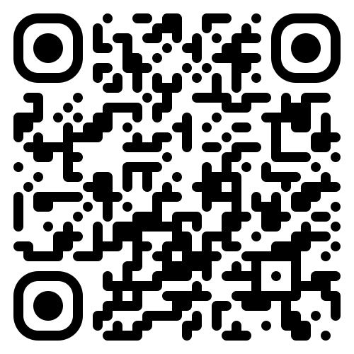
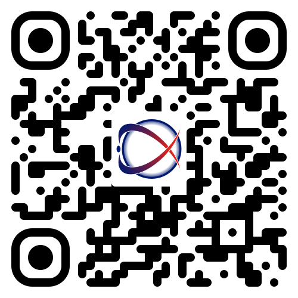

 
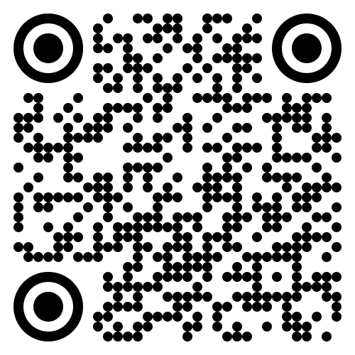
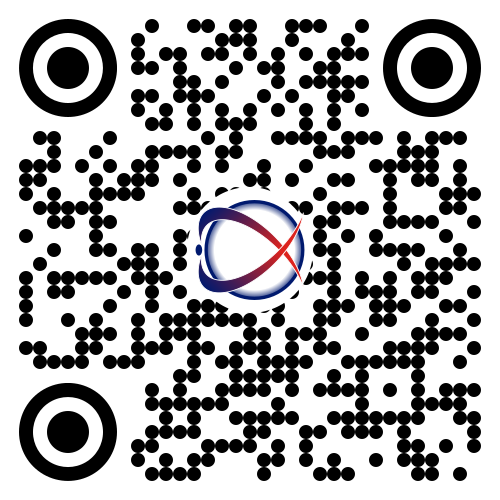

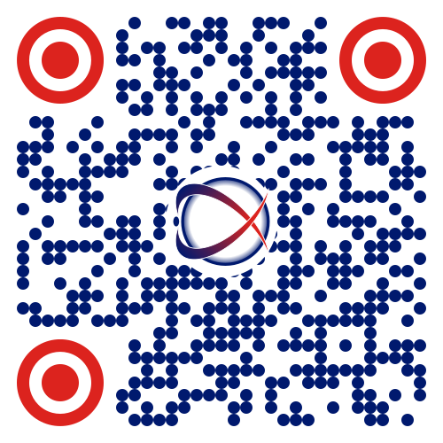

## QR for `https://aileron-projects.github.io/`

SVG and PNG images are available at [./website/](./website/).

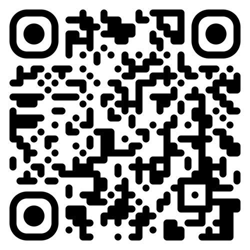
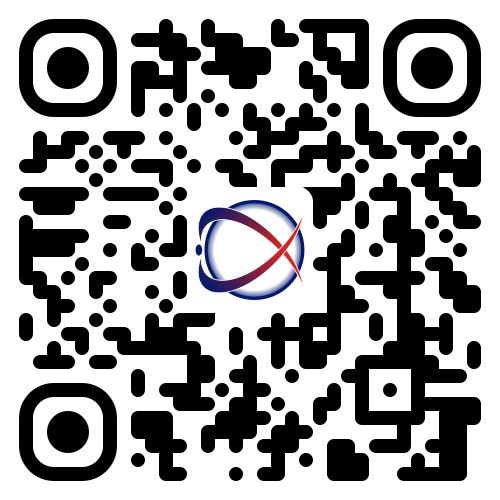

 
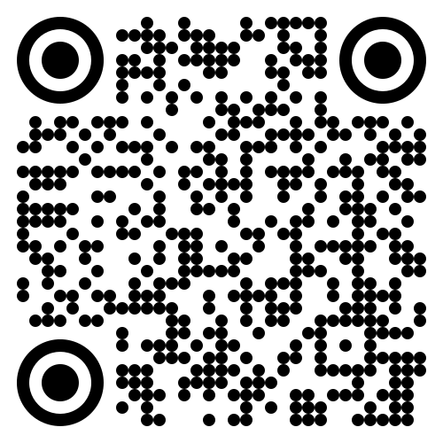
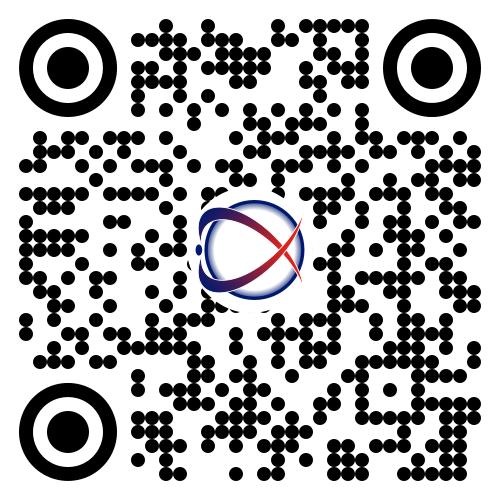
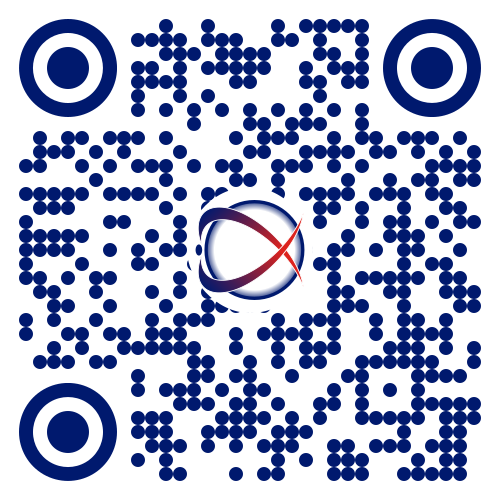
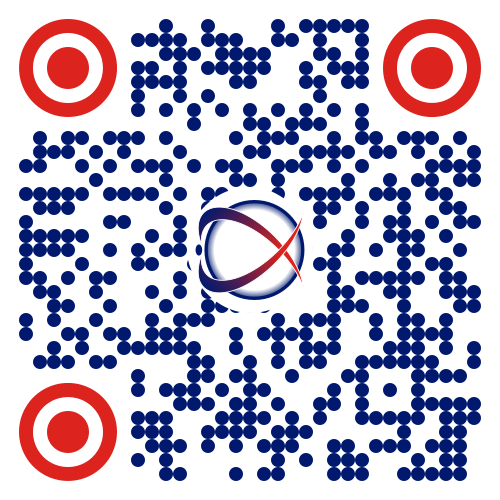

